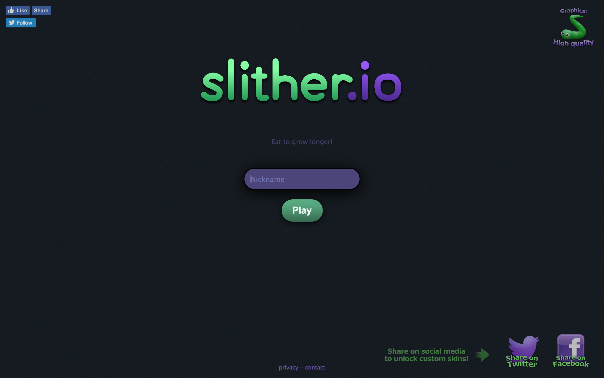

# JS Frogger

JS Frogger is a JavaScript rendition of the [classic 1981 arcade game called Frogger](https://en.wikipedia.org/wiki/Frogger). It was built using simple HTML, CSS, JavaScript, and jQuery, and does not include any other custom libraries or templates.

The game can be played at [my GitHub Pages site.](https://joepin.github.io/JS-Game-Project-Frogger/)

## Original Game

The object of the game is to navigate a frog sprite accross a busy street and a raging river. The user must navigate the treacherous terrains to bring the frogger to one of five homes, and can die in many ways:

- Getting hit by a truck/car
- Drowning in the river
- Moving off the screen
- Hitting an alligator or snake
- Trying to enter a home that already has a frog
- Missing the home by a little and hitting the shrubs in between the homes
- Running out of time

All in all, it's quite a difficult game to win at. The user has three lives to bring all five frogs to the homes, at which point they advance to another, more difficult level, without having their lives replenished.

## This Emulation

In my emulation, I limited the methods of dying to the following:

- Getting hit by a truck/car
- Drowning in the river
- Trying to enter a home that already has a frog

Play begins with a bunch of randomly generated trucks and logs already on the playing area, and continues to generate new ones off screen when the old ones move off the playing field.

The user controls a blue square, which is our frogger, with the arrow keys, and avoids seven lanes of truck-traffic, then crosses seven rows of river, hopping from log to log to do so.

## Technologies and Methodologies Employed

### General Concept

The overarching idea I had when building this game was to create a grid of divs on the screen, then simply style them when sprites move around on the screen. I found this to be more appealing than, say, moving sets of divs around because in my chosen method, I knew that I wouldn't have to worry about generating new HTML elements or positioning existing ones, which I thought would be a lot tougher to do and require more manipulation of CSS styles. Therefore, I chose to use JS to set and remove ID's and classes on my grid of divs to control movement and the runtime of the game.

### HTML

The HTML for my game, while quite long and repetitive, is very simple: I made 17 divs with 17 divs as their children, representing a 17X17 grid.

### CSS

The CSS of the game is a little more involved, yet simplified and dignified by the use of flexbox. The entire container div of my grid is a flex container, which allowed me to leave the sizing of each cell element to the browser to handle. I utilized a few media queries to resize this flex container and set a few other styles as well. I employed keyframes to change the box-shadow property of a few elements to give them a glowing look. Overall, the CSS is very straightforward, and doesn't do all that much.

### JavaScript

The heart of this game is in the JavaScript, which controls the entire experience of the game. The first encounter the user has with JS is on the landing page, where I simply move a picture of a frog around the screen at random.

The remainder of the JS code is implemented on the game.html page. I thought it necessary to break up the code into three files:

1) The file called ['globals.js'](scripts/globals.js) simply contains all the global variables I set and use in the game, and is kept separate from the actual code so that the variables can be used by the other two files from the first instance they're loaded.

2) The file called ['classes.js'](scripts/classes.js) defines three classes:
  - Sprite
  - Truck
  - Log  
   which will be explained below.

3) The file called ['game-script.js'](scripts/game-script.js) contans the runtime functions for the game, and is responsible for starting and playing the game.

I used the ES6 notation to define the classes, however I used ES5 everywhere else. 

The general flow of logic is as follows:
First, my app gets the passed in parameters from the form on the index page, which is currently just a nickname. My script displays the nickname, then calls my setup function followed by my play function. 

The setup function initializes a couple of vatriables, then creates trucks and logs on the screen at random. The play function calls a few other important functions on an interval, whose collective jobs it is to move and monitor the movement of the sprites and the frogger.

This is where the classes come in to the picture: each sprite is an object of the Sprite class, which has, as one of its properties, a reference to an instance of a type class (either Truck or Log). The Sprite class has methods for movement of the sprite, and barely contains any data. In contrast, the other two classes contain all the information pertaining to a sprite, and simply store and track things like the current position of the sprite, as well as the direction it's moving in and the next element it will be taking up.

Moving the sprites is fairly simple in theory: first we determine which elements the sprite occupies, then we determine the next ones to move up, and finally we do just that.

In a similar fashion, we move the frogger; except that moving the frogger is made simpler because it only entails moving one ID from element to element.

Detecting collisions becomes very easy thanks to our use of the grid, as all we have to do is check the current element's dataset to see whether or not or frogger is allowed on that element.

Lastly, leveling up is accomplished by resetting the entire game board, and changing two variables to increase the difficulty. The first is a multiplier that determines the maximum number of sprites allowed on the board at once, and the second is a speed value that determines the rate at which the setInterval function runs.

## Challenges

It took me a long time and a lot of strenuous effort to get the movement working as I thought it should work because I underestimated the complexity that was necessary to imbue into my move methods. I didn't always think my logic through completely, which caused me much stress when I skipped over something so silly.

The other major challenge I had was with generating sprite elements on the board that didn't collide with existing elements. I found it quite difficult to create the perfect validation function that would keep the sprites separate from each other, and got crashed my browser many many times in endless loops because of it.

## Landing Page

My landing page and overall theme of my site was inspired by that of [slither.io](http://slither.io/). I liked the bleak simplicity of the page, and the efficiency of the design; it is quite clear that the sole purpose of the page is to get the user to play the game as quickly as possible.

And my wireframe of the game can be found [here](https://wireframe.cc/fBjoaA)

## Links

GitHub Pages: https://joepin.github.io/JS-Game-Project-Frogger/

WireFrame: https://wireframe.cc/fBjoaA
